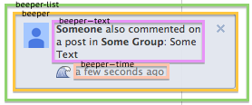
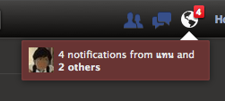

# beeper.yml

## beeper

The notification popup
that appears at the bottom-left corner of the screen.
It used to be called a "uiBeeper",
hence the name beeper.

__Selectors:__

 * ._3sod

## beeper--text

__Selectors:__

 * ._3sod ._3soi

## beeper--time

__Selectors:__

 * ._3sod ._3som

## beeper-list

The notification popup list.

__Selectors:__

 * ._50d1

## beeper-notification-jewel

The notification popup
that appears briefly on the notifications jewel.

__Selectors:__

 * ._53ii ._53ij

