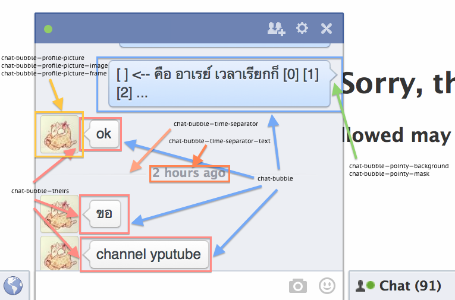

# chat/bubble.yml

## chat-bubble

A chat bubble in the new theme in Facebook chat.

__Selectors:__

 * .bubbles ._kso, .bubbles ._kso:before

## chat-bubble--pointy

The pointy in the chat bubble.

__Selectors:__

 * .bubbles ._kso, .bubbles ._kso:before

## chat-bubble--pointy--background

__Selectors:__

 * .bubbles ._kso:before

## chat-bubble--pointy--mask

__Selectors:__

 * .bubbles ._kso:after

## chat-bubble--theirs

__Selectors:__

 * .bubbles ._50kd ._kso, .bubbles ._50kd ._kso:before

## chat-bubble--profile-picture

__Selectors:__

 * .bubbles ._50dw .profileLink

## chat-bubble--profile-picture--image

__Selectors:__

 * ._50dw .profileLink .profilePhoto

## chat-bubble--profile-picture--frame

__Selectors:__

 * .bubbles ._50dw .profileLink:after

## chat-bubble--time-separator

__Selectors:__

 * .bubbles ._511m

## chat-bubble--time-separator--text

__Selectors:__

 * .bubbles div._511n

