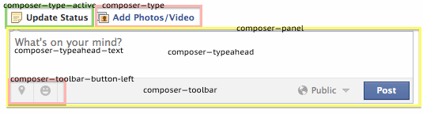
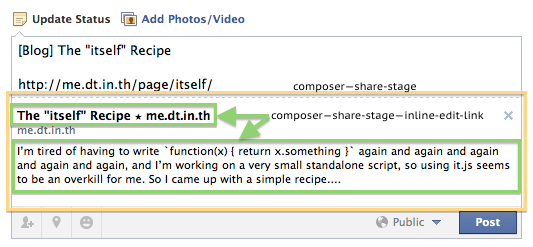
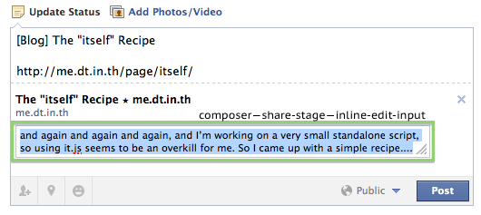

# composer.yml

## composer

The status update box, one that asks you, "what's on your mind?"

__Selectors:__

 * ._55d0

## composer--type

The post type, such as "Update Status", "Add Photos/Video" text.

__Selectors:__

 * ._9lb

## composer--type--active

__Selectors:__

 * ._519b ._9lb

## composer--panel

The composer box that holds the whole composer panel.

__Selectors:__

 * ._2yg

## composer--toolbar

The composer toolbar

__Selectors:__

 * ._1dsp

## composer--toolbar--button-left

The buttons at the bottom left of the composer toolbar.
The buttons to "Tag Location" or add a "Feeling".

__Selectors:__

 * ._1dsq

## composer--typeahead

The text box to enter your status.

__Selectors:__

 * .composerTypeahead

## composer--typeahead--text

__Selectors:__

 * .composerTypeahead textarea

## composer--border

The border that separates the composer from the rest of the stream posts.

__Found:__ Close friends stream

__Selectors:__

 * ._50zb

## composer--share-stage

The "link preview".

__Selectors:__

 * ._4_4e

## composer--share-stage--inline-edit-link

__Selectors:__

 * .UIShareStage a.inline_edit

## composer--share-stage--inline-edit-input

__Selectors:__

 * .UIShareStage input.inline_edit
 * .UIShareStage textarea.inline_edit

