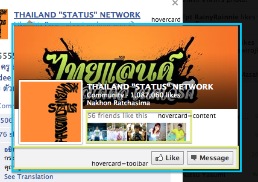
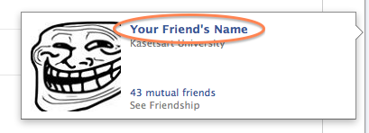

# hovercard.yml

## hovercard

When you hover over a friend and their more information pops up,
that's a hovercard!

__Selectors:__

 * ._53ip ._53ij

## hovercard--toolbar

The toolbar that shows the friend list they are in,
as well as a button to send them a message.

__Selectors:__

 * ._53ip ._53ij .uiBoxGray

## hovercard--content

The part that displays information,
such as mutual friends count.

__Selectors:__

 * ._7lu

## hovercard--name

The friend's name when hovering a name in chat.

__Selectors:__

 * ._7lu .fwb.fsl a

