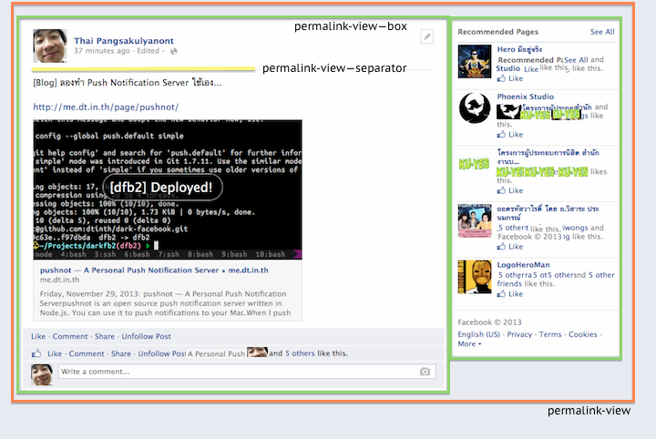

# permalink.yml

## permalink-view

The permalink view, when you are viewing a single post.
For example, <https://www.facebook.com/dtinth/posts/10200488232002504>.

__Found:__ When viewing single post

__Selectors:__

 * .permalinkBody #contentCol

## permalink-view--box

__Selectors:__

 * .permalinkBody #rightCol
 * .permalinkBody #contentArea

## permalink-view--separator

__Selectors:__

 * .fbStreamPermalinkHeader

