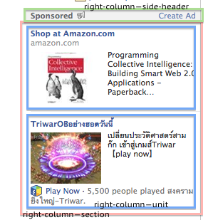
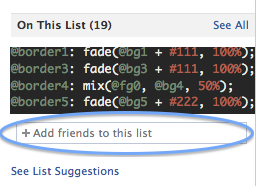

# right-column.yml

## right-column

The right column at the right of each page.

__Selectors:__

 * #rightCol

## right-column--section

Each section in the right column.

__Selectors:__

 * .ego_unit_container

## right-column--unit

Each unit in each section.

__Selectors:__

 * .ego_unit

## right-column--border

The footer border that separates the rest of the right-hand column from the footer.

__Selectors:__

 * .rhcFooterBorder

## right-column--side-header

The header of each section in the right column.

__Selectors:__

 * #rightCol .uiHeader

## right-column--side-header--link

__Selectors:__

 * #rightCol .uiHeader a
 * #rightCol .uiHeader a span

## right-column-reminder

The reminders. For example, birthday, upcoming events, and so on.

__Selectors:__

 * .fbRemindersStory

## right-column-reminder--title

The reminder title. e.g. the friend's name.
Need to make it look like a link.

__Selectors:__

 * .fbRemindersTitle

## right-column-add-friend-typeahead

Add friends to this list textbox.

__Found:__ Close friend stream, right of page

__Selectors:__

 * .friendListAddTypeahead

## right-column-sponsored

The sponsored section with a lot of links.

__Found:__ News feed.

__Selectors:__

 * #pagelet_ego_pane .ego_unit

## right-column-sponsored--title

__Selectors:__

 * ._5fxj ._5fxk

## right-column-sponsored--domain

__Selectors:__

 * ._5fxj ._5fxl

## right-column-sponsored--description

__Selectors:__

 * ._5fxm ._5fxn

