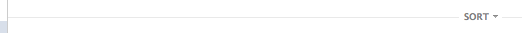

# stream/header.yml

## stream-header

![docs/images/components/stream-header[2].png](../images/components/stream-header[2].png)

The stream header in the news feed
that lets the user sort their news feed by
"Top Stories" or "Most Recent".

Also, this can be a section separator.
For example, in group page, the header that says,
"Pinned Post" and "Recent Posts".

__Found:__ News feed and group with pinned posts

__Selectors:__

 * .uiStreamHeader

## stream-header--sorter

The "Top Stories / Most Recent text" text.

__Found:__ News feed

__Selectors:__

 * .uiStream .uiStreamHeader .uiStreamHeaderChronologicalForm

## stream-header--text

The "Pinned Post / Recent Posts" text.

__Found:__ Group with pinned posts

__Selectors:__

 * .uiStreamHeaderText

## stream-header--text(related-post)

In the news feed,
sometimes facebook injects a story like:
"Friend A and Friend B like Page X".
Under that story exists a section called "Related Post"
which displays a related post from Page X.

__Selectors:__

 * ._5pbe

## stream-header--text(similar-pages)

In the news feed,
when you like a post by some page,
sometimes Facebook will offer you to like pages they think are similar.

__Selectors:__

 * .uiStreamEdgeStoryLineTx

