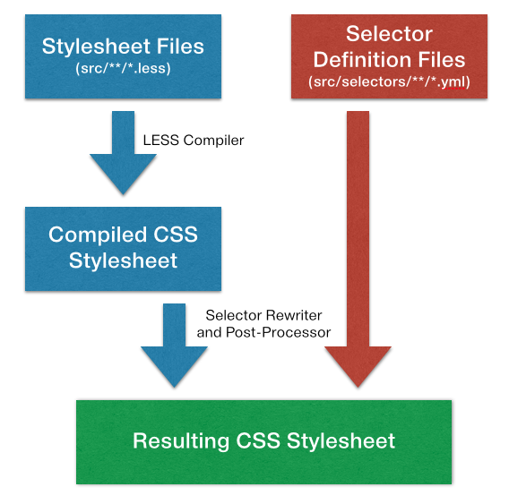

Theming Process (a.k.a. How it Works)
=====================================

The theming process for this project is very different from other user styles:

* It separates the site-specific CSS selectors.
* Every CSS selectors are identified by name and documented, separate of the CSS styles.





1. LESS Files
-------------

The LESS files do NOT contain facebook-specific CSS selectors.
Why?
Because facebook likes to roll out new changes
that changes the CSS classes and selectors,
and thus break the theme.

Instead,
components are identified by using an internal name:


```less
:::stream-header {
  background: @border1;
  &--sorter, &--text {
    background: @bg1;
    color: @mute-color;
  }
}
```

In this case, we name the components:

* `:::stream-header`
* `:::stream-header--sorter`
* `:::stream-header--text`


2. Selector Definition Files
----------------------------

Because the selectors change often,
each selector we use in the user style must be documented.

This makes it easy to fix the style!

```yaml
stream-header:
  found: News feed and group with pinned posts
  info: |
    The stream header in the news feed
    that lets the user sort their news feed by
    "Top Stories" or "Most Recent".

    Also, this can be a section separator.
    For example, in group page, the header that says,
    "Pinned Post" and "Recent Posts".
  selector: ".uiStreamHeader"
  children:
    sorter:
      selector: ".uiStream .uiStreamHeader .uiStreamHeaderChronologicalForm"
      info: The "Top Stories / Most Recent text" text.
      found: News feed
    text:
      selector: ".uiStreamHeaderText"
      info: The "Pinned Post / Recent Posts" text.
      found: Group with pinned posts
```

### Selector Definition File Specification

Each selector definition file contains a Hash.

The key is the internal component name,
which can be refered in the LESS files using `:::(component name)`.

```yaml
(component name):
  info:      STRING
  found:     STRING
  selector:  STRING or ARRAY
  children:  HASH
    (component name): ...
    (component name): ...
    ...
```

* __info__: Write some information about this component and selector.
* __found__: Give an example where this component can be found.
* __selector__: The CSS selector or an array of CSS selectors (see below).
* __children__: A hash of child components (see below).


#### Selector Hierarchy

The __children__ field contains a hash of child components.
The child components can then be identified using the selector
`:::(parent component name)--(child component name)`.

This is to prevent a duplication of component name all over the place
and establish a hierarchy.

Hierarchy can be used for:

* __Child components__, such as the a _row_ inside a comment list.
  Note that the child component doesn't need to actually be a childen of the
  parent component in facebook's DOM.
* __Specialization__, such as the selected/active state of a component.

```yaml
comments:
  selector: ".UFIList"
  info: The comments list found throughout facebook.
  children:
    row: # <-- this is a subcomponent (row) of the parent component (comment list)
      selector: ".UFIRow"
      children:
        unseen: # <-- this is a specialization of a row.
          selector: "&.UFIUnseenItem"
    textbox: # <-- note that in facebook, the textbox is actually inside a row
             #     but I think it's better for it to be outside.
      selector: "& .uiTypeahead"
      info: The input box to post comment.
```


#### Selector Field

The selector field is for specifying the selector of that component.

However, some component may have multiple selectors,
so you can use an array instead.

```yaml
    border:
      info: The border around a share box.
      selector:
        - ".shareRedesignTopBorder"
        - ".shareRedesignBottomBorder"
        - ".shareRedesignRightBorder"
```

Note that the field name is still `selector` and not `selectors`!

For child components, you can use `&` to refer to the selector
of the parent component.

For example,

```yaml
comments:
  selector: ".UFIList"
  children:
    textbox:
      selector: "& .uiTypeahead"
```

The `:::comments--textbox` would mean `.UFIList .uiTypeahead`.


#### Categories

Facebook likes to have several possible CSS for the same thing.

When a new version of the news feed is rolled out,
they use a new set of CSS classes,
and that means we need to use the new CSS selectors.

By using "categories" (I borrowed the name from Objective-C, lol),
we can map several selectors to the same component name.

Just put the category name in a parentheses after the component name.

```yaml
stream-story(uistory):
  selector: ".uiStreamStory"
  children:
    headline:
      selector: "h5.uiStreamHeadline"
      children:
        author(active):
          selector: "& .actorName a"
        author(passive):
          selector: "& a.passiveName"
stream-story(2013-11-22):
  selector: "._5srp"
  children:
    headline:
      selector: "._5pbw"
      children:
        author:
          selector: "& .fwb a"
    separator:
      selector: "._5srp"
stream-story(2013-11-23):
  selector: "._5uch"
  children:
    separator: { selector: "._5uch" }
```

Here,
all of the top level components get the same name `stream-story`,
and `:::stream-story` will expand to these selectors:

* `.uiStreamStory`,
* `._5srp`,
* `._5uch`


In the same way,
`::stream-story--headline--author` will expand to:

* `h5.uiStreamHeadline .actorName a`,
* `h5.uiStreamHeadline a.passiveName`,
* `._5pbw .fwb a`


3. The Build Process
--------------------

The build process consists of several stages:


### 3.1 Compiling LESS files

This is just a normal LESS compilation.
Nothing fancy.
The output looks like this.

```css
:::stream-header {
  background: #464544;
}
:::stream-header--sorter,
:::stream-header--text {
  background: #353433;
  color: #8b8685;
}
```

Note that it uses an internal selector.


### 3.2 Build the Selector Map

Meanwhile,
the compiler also reads all `.yml` files
and build a selector map.

```
:::stream-header           => - .uiStreamHeader
:::stream-header--sorter   => - .uiStream .uiStreamHeader .uiStreamHeaderChronologicalForm
:::stream-header--text     => - .uiStreamHeaderText
```


### 3.3 Rewrite the CSS

The CSS from the previous stage is rewritten:

* The internal selectors are replaced with facebook's selectors.
* `!important` rules are added.

```css
.uiStreamHeader {
  background: #464544 !important;
}

.uiStream .uiStreamHeader .uiStreamHeaderChronologicalForm,
.uiStreamHeaderText {
  background: #353433 !important;
  color: #8b8685 !important;
}
```


